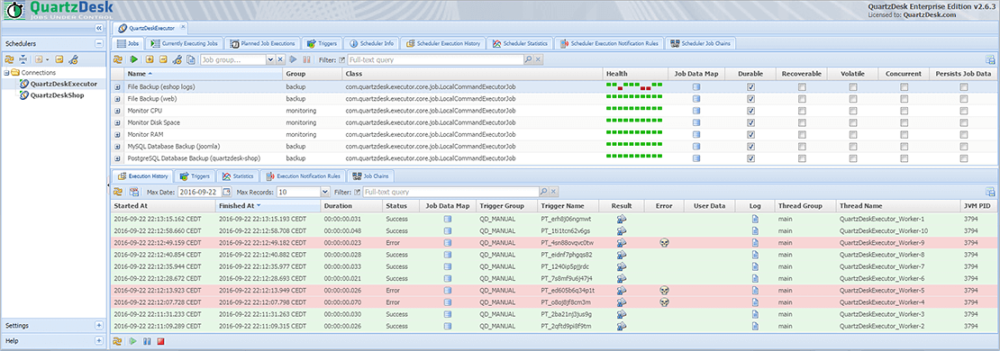

# Introduction

QuartzDesk Executor (QE) is a simple, yet powerful Java Quartz scheduler based web application that allows you to replace legacy scheduling systems, such as Unix/Linux cron, with a robust, scalable and optionally distributed scheduling system that offers many advantages such as:

* User-friendly and web-based GUI.
* Viewing the list of all currently executing jobs.
* Persistent execution history of individual jobs and triggers.
* Job execution notifications (email, IM, SNMP Trap, external web-service, ...).
* Job chaining capabilities allowing you to create complex workflows.
* Visual execution statistics.
* Interception of messages produced by executed jobs in the QE log and/or on stdout/sterr.
* JAX-WS SOAP endpoints exposing most of the functionality accessible in the GUI.
* Etc. 

**In order to make use of all these features, it is required that you also install [QuartzDesk](https://www.quartzdesk.com).** QuartzDesk is an enterprise-class management and monitoring platform for Java Quartz schedulers embedded in all types of Java applications. 

# Requirements

### Java
JDK 8 or newer.

### Application Container / Server
Any modern Java servlet container or application server. QE is known to work on:

* Apache Tomcat
* IBM Websphere AS
* Oracle GlassFish AS
* Oracle WebLogic AS
* RedHat JBoss AS
* WildFly AS

### Database
 
| DBMS                       | Minimum Version          |
|:---------------------------|:-------------------------|
| DB2                        | 10.1                     |
| H2                         | 1.3.174                  |
| Microsoft SQL Server       | 2008 R2 SP1              |
| MySQL                      | 5.6.4                    |
| Oracle                     | 10.2 (10g R2)            |
| PostgreSQL                 | 9.1                      |

# Available Quartz Job Implementation Classes

QE provides the following Quartz job implementation classes that can be used to schedule various types of tasks.

##  com.quartzdesk.executor.core.job.LocalCommandExecutorJob
A Quartz job implementation class that can be used to execute local commands (e.g. shell commands) and scripts located on the local host (i.e. the host QE has been deployed on).

This job supports the following job data map parameters:

`command`: a shell command or script to execute on the local host.

`commandWorkDir`: an optional work directory to pass to the executed command / script as the "current working directory".

`commandArgs`: an optional, space-separated list of arguments to pass to the command / script. If you need to pass an argument containing spaces, enclose the argument value in double or single quotes.

##  com.quartzdesk.executor.core.job.SshRemoteCommandExecutorJob
A Quartz job implementation class that can be used to execute commands (e.g. shell commands) and scripts located on a remote host over SSH. This job requires the remote host to run the SSHD service through which commands and scripts are executed.

This job supports the following job data map parameters:

`sshHost`: a host name or IP of the remote host where the command or script should be executed.

`sshPort`: an SSH port number of the SSHD service running on the remote host.

`sshUser`: an SSH username to authenticate the user with.

`sshPassword`: an SSH password to authenticate the user with if the password-based authentication should be used.

`sshPrivKeyFile`: filepath of the SSH private key file to authenticate the user with if the key-based authentication should be used.

`command`: a shell command or script to execute on the remote host.

`commandArgs`: an optional, space-separated list of arguments to pass to the command / script. If you need to pass an argument containing spaces, enclose the argument value in double or single quotes.

If both `sshPassword` and `sshPrivKeyFile` are specified, then the key-based authentication takes precedence.

##  com.quartzdesk.executor.core.job.UrlInvokerJob
A Quartz job implementation class that can be used to execute HTTP HEAD, GET and POST requests to the configured URL.

This job supports the following job data map parameters:

`url`: the URL to send the HTTP request to.

`method`: the HTTP request method - HEAD, GET, POST. If not specified, GET method is assumed.

`postBody`: an optional HTTP POST body data.

`postBodyContentType`: an optional content type of the HTTP POST body (e.g. application/json). Required if `postBody` is present.

`username`: an optional HTTP Basic authentication username.

`password`: an optional HTTP Basic authentication password.

`connectTimeout`: an optional connect timeout in milliseconds. This is the maximum time UrlInvokerJob waits for the HTTP connection to be established before failing with an error. By default, the connect timeout is infinite.

`socketTimeout`: an optional socket timeout in milliseconds. This is the maximum time UrlInvokerJob waits for the HTTP response data before failing with an error. By default, the socket timeout is infinite.

`header[name]`: an optional custom HTTP header. The HTTP header's name must be enclosed in square brackets, e.g. `header[User-Agent]`.

##  com.quartzdesk.executor.core.job.SqlQueryExecutorJob
A Quartz job implementation class that can be used to execute arbitrary SQL queries on a local or remote DB server through JDBC. If the executed query returns a result set, the data is exported into the CSV format and saved as the job's execution result that can be viewed in the QuartzDesk GUI, passed to chained jobs, or used in execution notification rules to fire notification messages.

This job supports the following job data map parameters:

`jdbcDriver`: the fully-qualified class name of the JDBC driver to use. The driver must be on the QE application's classpath.

`jdbcUsername`: a JDBC username.

`jdbcPassword`: a JDBC password.

`jdbcUrl`: a JDBC URL pointing to the target database.

`sqlQuery`: the SQL query to execute.

##  com.quartzdesk.executor.core.job.ExternalQuartzJobExecutorJob
A Quartz job implementation class that allows you to schedule externalized Quartz job implementation classes that reside outside of QE. Therefore you can easily update these externalized Quartz jobs without restarting and redeploying QE and you can even schedule execution of multiple versions of the same Quartz job implementation class.

This job supports the following job data map parameters:

`jobClassName`: the fully qualified Quartz job implementation class name. The job class must extend the Quartz org.quartz.Job interface.

`jobHomeDir`: the Quartz job home directory that contains all classes and libraries required by the job. This directory must have the following structure:

&nbsp;&nbsp;&nbsp;&nbsp;`classes`: a directory containing classes and resources required by the Quartz job.
  
&nbsp;&nbsp;&nbsp;&nbsp;`lib`: a directory containing libraries (JAR files) required by the Quartz job. Do not add the Quartz library into this directory because this library is already provided by QE!

# Job Data Map Macros

All QE job implementation classes support the use of macros in their job data map parameter values. The macros are automatically expanded before a job is executed. 

If a macro name is not recognized, then it is preserved as is and is not expanded.

If a macro name is recognized and its value is not available (is null), then it is expanded into an empty string. 

The following macros are supported:

| Macro                   | Description                                                                                                                                                                                                                                                                    | Examples                                                                                            |
|-------------------------|--------------------------------------------------------------------------------------------------------------------------------------------------------------------------------------------------------------------------------------------------------------------------------|:----------------------------------------------------------------------------------------------------|
| `${CURRENT_TIMESTAMP}`    | Expanded to the current timestamp in the ISO8601 format. 
This macro accepts an optional pattern ([SimpleDateFormat](https://docs.oracle.com/javase/8/docs/api/java/text/SimpleDateFormat.html) pattern) that determines the format of the timestamp.                       | `${CURRENT_TIMESTAMP}` - "2022-10-17T13:25:27.443+0200"
 `${CURRENT_TIMESTAMP, yyyy-MM-dd}` - "2022-10-17"   |
| `${CURRENT_TIMESTAMP}` | Expanded to the current scheduler's object name.                                                                                                                                                                                                                               | "quartz:type=QuartzScheduler,name=QuartzDeskExecutor,instance=FooBar"                               |
| `${SCHEDULER_VERSION}`    | Expanded to the current scheduler's version number.                                                                                                                                                                                                                            | "2.3.2"                                                                                             |
| `${SCHEDULER_INSTANCE_ID}` | Expanded to the current scheduler's instance ID.                                                                                                                                                                                                                               | "FooBar"                                                                                            |
| `${SCHEDULER_NAME}`       | Expanded to the current scheduler's name.                                                                                                                                                                                                                                      | "QuartzDeskExecutor"                                                                                |
| `${JOB_GROUP_NAME}`       | Expanded to the current job's group name.                                                                                                                                                                                                                                      | "MyJobGroup"                                                                                        |
| `${JOB_NAME}`             | Expanded to the current job's name.                                                                                                                                                                                                                                            | "MyJob"                                                                                             |
| `${JOB_DESCRIPTION}`      | Expanded to the current job's description.                                                                                                                                                                                                                                     | "MyJob is a job that performs X, Y and Z."                                                          |
| `${JOB_CLASS_NAME}`       | Expanded to the current job's implementation class name.                                                                                                                                                                                                                       | "com.quartzdesk.executor.core.job.UrlInvokerJob"                                                    |
| `${JOB_CLASS_LOCATION}`   | Expanded to the current job's implementation class location path.                                                                                                                                                                                                              | "/C:/Tomcat/webapps/quartzdesk-executor-web-4.0.15/WEB-INF/lib/quartzdesk-executor-core-4.0.15.jar" |
| `${TRIGGER_GROUP_NAME}`   | Expanded to the current trigger's group name.                                                                                                                                                                                                                                  | "MyTriggerGroup"                                                                                    |
| `${TRIGGER_NAME}`         | Expanded to the current trigger's name.                                                                                                                                                                                                                                        | "MyTrigger"                                                                                         |
| `${TRIGGER_DESCRIPTION}`  | Expanded to the current trigger's description.                                                                                                                                                                                                                                 | "MyTrigger is a cron trigger that fires MyJobGroup.MyJob job at midnight every day."                |
| `${TRIGGER_TYPE}`         | Expanded to the current trigger's type - "SIMPLE", "CRON", "CALENDAR_INTERVAL", "DAILY_TIME_INTERVAL".                                                                                                                                                                         | "SIMPLE"                                                                                            |
| `${CALENDAR_NAME}`        | Expanded to the current trigger's calendar name.                                                                                                                                                                                                                               | "MyCalendar"                                                                                        |
| `${EXEC_TYPE}`            | Expanded to the current job's execution type - "NORMAL", "MANUAL", "JOB_CHAIN", "WEB_SERVICE", "SYSTEM".                                                                                                                                                                       | "NORMAL"                                                                                            |
| `${JOB_EXECUTION_ID}`     | Expanded to the current job's execution ID.                                                                                                                                                                                                                                    | "FooBar1666016938865@quartz:type=QuartzScheduler,name=QuartzDeskExecutor,instance=FooBar"      |
| `${FIRE_INSTANCE_ID}`     | Expanded to the current job's fire instance ID.                                                                                                                                                                                                                                | "FooBar1666016938865"                                                                                                    |
| `${FIRE_TIME}`            | Expanded to the current job's actual fire timestamp. in the ISO8601 format. 
This macro accepts an optional pattern ([SimpleDateFormat](https://docs.oracle.com/javase/8/docs/api/java/text/SimpleDateFormat.html) pattern) that determines the format of the timestamp.    | `${FIRE_TIME}` - "2022-10-17T00:00:00.000+0200"
 `${FIRE_TIME, yyyy-MM-dd}` - "2022-10-17"           |
| `${SCHEDULED_FIRE_TIME}`  | Expanded to the current job's scheduled fire timestamp. in the ISO8601 format. 
This macro accepts an optional pattern ([SimpleDateFormat](https://docs.oracle.com/javase/8/docs/api/java/text/SimpleDateFormat.html) pattern) that determines the format of the timestamp. | `${SCHEDULED_FIRE_TIME}` - "2022-10-17T00:00:00.000+0200"
 `${SCHEDULED_FIRE_TIME, yyyy-MM-dd}` - "2022-10-17"           |
| `${PREVIOUS_FIRE_TIME}`   | Expanded to the current job's previous fire timestamp. in the ISO8601 format. 
This macro accepts an optional pattern ([SimpleDateFormat](https://docs.oracle.com/javase/8/docs/api/java/text/SimpleDateFormat.html) pattern) that determines the format of the timestamp.  | `${PREVIOUS_FIRE_TIME}` - "2022-10-17T00:00:00.000+0200"
 `${PREVIOUS_FIRE_TIME, yyyy-MM-dd}` - "2022-10-17"           |
| `${NEXT_FIRE_TIME}`       | Expanded to the current job's previous fire timestamp. in the ISO8601 format. 
This macro accepts an optional pattern ([SimpleDateFormat](https://docs.oracle.com/javase/8/docs/api/java/text/SimpleDateFormat.html) pattern) that determines the format of the timestamp.  | `${NEXT_FIRE_TIME}` - "2022-10-17T00:00:00.000+0200"
 `${NEXT_FIRE_TIME, yyyy-MM-dd}` - "2022-10-17"           |
| `${RECOVERING}`           | Expanded to true or false reflecting the current job's recovery status.                                                                                                                                                                                                        | "false"                                                                                             |

# Installation

**QE is a Spring-based web application that can be deployed to any Java servlet container or application server**. At this time we only provide installation instructions for Apache Tomcat. For details, please refer to [INSTALLATION-Tomcat.md](INSTALLATION-Tomcat.md). 

# Forking

We encourage you to fork, extend, repackage and distribute QE and all derivative work as you want. We only kindly ask you to follow these guidelines:

* Please change the root package name of your forked version from `com.quartzdesk` to a different package name so that it is clear your forked version is not the original QE version that is maintained by us. 
* Please do not refer to your forked version as QuartzDesk Executor, nor as QE. 
* Please consider including a link to our QuartzDesk Executor GitHub repository (https://github.com/quartzdesk/quartzdesk-executor) in your documentation. 

Thank you.

# Contributing

If you want to contribute your changes and improvements, please contact us so that we can send you our contributing guidelines. Included are coding standards, and notes on development.

# Copyright and License

Code and documentation copyright 2015-2018 the QuartzDesk Executor authors and QuartzDesk.com. Code and docs released under the MIT license.
